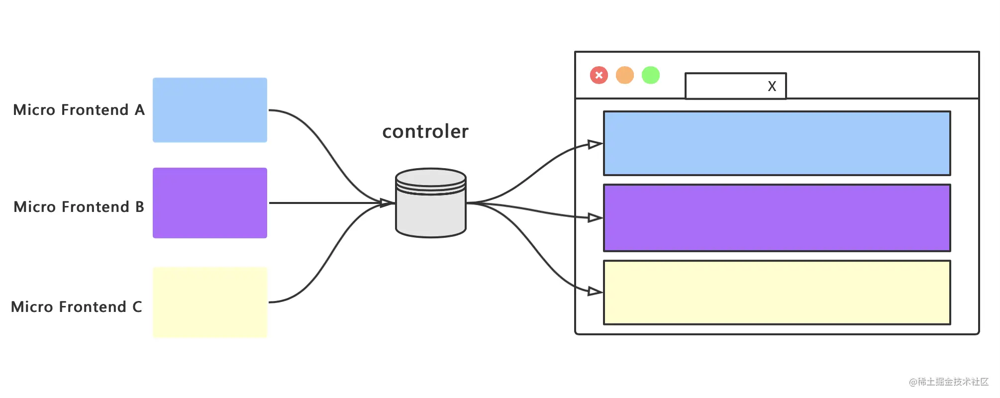
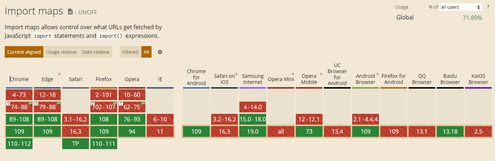

# 关于微前端的理解与实现

## 微前端概述

1. 什么是微前端(**what**)

微前端是一种类似于微服务的架构，是一种由独立交付的多个前端应用组成整体的架构风格，将前端应用分解成一些更小、更简单的能够独立开发、测试、部署的应用，而在用户看来仍然是内聚的单个产品。有一个基座应用（主应用），来管理各个子应用的加载和卸载。



微前端的三大核心原则：`独立运行`、`独立部署`、`独立开发`

2. 为什么要使用微前端(**why**)

- 2.1 增量迁移

迁移是一项非常耗时且艰难的任务，比如有一个管理系统使用 AngularJS 开发维护已经有三年时
间，但是随时间的推移和团队成员的变更，无论从开发成本还是用人需求上，AngularJS 已经不能
满足要求，于是团队想要更新技术栈，想在其他框架中实现新的需求，但是现有项目怎么办？直接
迁移是不可能的，在新的框架中完全重写也不太现实。

- 2.2 独立发布

在目前的单页应用架构中，使用组件构建用户界面，应用中的每个组件或功能开发完成或者bug修
复完成后，每次都需要对整个产品重新进行构建和发布，任务耗时操作上也比较繁琐。
在使用了微前端架构后，可以将不能的功能模块拆分成独立的应用，此时功能模块就可以单独构建
单独发布了，构建时间也会变得非常快，应用发布后不需要更改其他内容应用就会自动更新，这意
味着你可以进行频繁的构建发布操作了。

- 2.3 允许单个团队做出技术决策

因为微前端构架与框架无关，当一个应用由多个团队进行开发时，每个团队都可以使用自己擅长的
技术栈进行开发，也就是它允许适当的让团队决策使用哪种技术，从而使团队协作变得不再僵硬。

3. 如何使用微前端(**how**)

- 3.1 多个微应用如何进行组合？

在微前端架构中，除了存在多个微应用以外，还存在一个`容器应用`，每个微应用都需要被注册到容器应用中。

微前端中的每个应用在浏览器中都是一个独立的`JavaScript模块`，通过`模块化`的方式被容器应用启动和运行。

使用模块化的方式运行应用可以防止不同的微应用在同时运行时发生冲突。

- 3.2 在微应用中如何实现路由？

在微前端架构中，当路由发生变化时，容器应用首先会拦截路由的变化，根据路由匹配微前端应用，当匹配到微应用以后，再启动微应用路由，匹配具体的页面组件。

- 3.3 微应用与微应用之间如何实现状态共享？

在微应用中可以通过`发布订阅模式`实现状态共享

- 3.4 微应用与微应用之间如何实现框架和库的共享？

通过`import-map`和`webpack`中的`externals`属性。

## 前置知识

### SystemJS

在微前端架构中，微应用需要被打包为`模块`，在过去，浏览器是不支持直接加载模块的，那个时候`ES Module`还未成为标准，
在浏览器端只能通过`require.js(AMD)`、`sea.js(CMD)`等方案实现模块加载，随着`node(CJS)`在前端界的流行，一个项目中可能存在多种模块规范，由此**SystemJS**应用而生，它实际上就是一个`动态模块加载器`

```html
<script type="systemjs-importmap">
  {
    "imports": {
      "moment": "https://cdn.jsdelivr.net/npm/moment/dist/moment.js",
      "lodash": "https://cdn.jsdelivr.net/npm/lodash/dist/lodash.js"
    }
  }
</script>
<script src="https://cdn.jsdelivr.net/npm/systemjs/dist/system.js"></script>
```

后来，随着`ES6`的普及，越来越多的浏览器开始支持`ES Module`，`SystemJS`是现阶段下(浏览器尚未正式支持importMap)原生 ES Module 的替代品，ES Module 被编译成`System.register`格式之后能够跑在旧版本的浏览器当中。

###  Import Maps

```html
<script type="module">
  import moment from "moment";
  import { partition } from "lodash";
</script>
```
这样写会报错，原因是在浏览器中，`import`必须给出`相对或绝对的URL路径`。没有任何路径的模块被称为`裸（bare）模块`。在`import`中不允许这种模块。

某些环境，像`Node.js`或者打包工具允许没有任何路径的裸模块，因为它们有自己查找模块的方法。但是浏览器尚不支持裸模块。

但是如果有了`Import Maps`

```html
<script type="importmap">
  {
    "imports": {
      "moment": [
        // 这里提供了兜底方案，如果CDN挂了会回退引用本地版本
        "https://cdn.bootcdn.net/ajax/libs/moment.js/2.29.4/locale/zh-cn.js",
        "/node_modules/moment/src/moment.js"
      ],
      "lodash": "/node_modules/lodash-es/lodash.js"
    }
  }
</script>

<script type="module">
  import moment from "moment"
  import { partition } from "lodash"
</script>
```

上面的写法就能被解析为：

```html
<script type="module">
  import moment from "/node_modules/moment/src/moment.js";
  import { partition } from "/node_modules/lodash-es/lodash.js";
</script>
```

目前关于`Import Maps`的兼容性：



对于不兼容该特性的浏览器，需要遵循上一篇所属使用`SystemJS`
