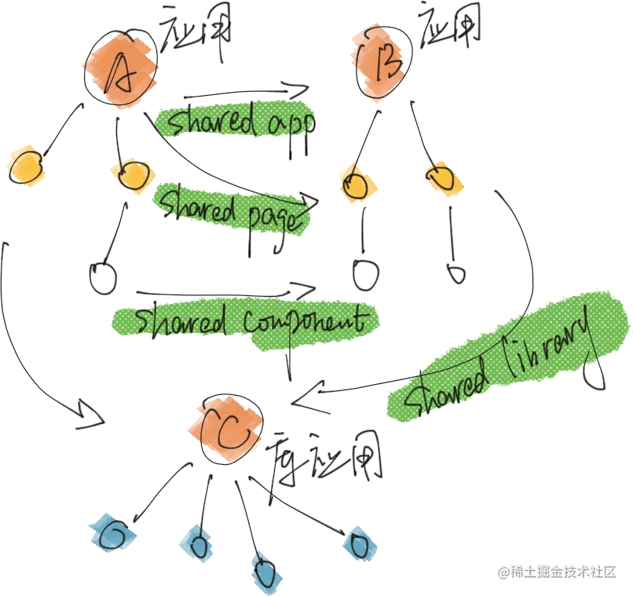
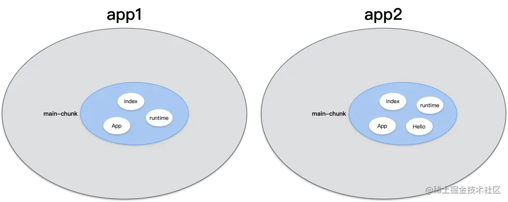
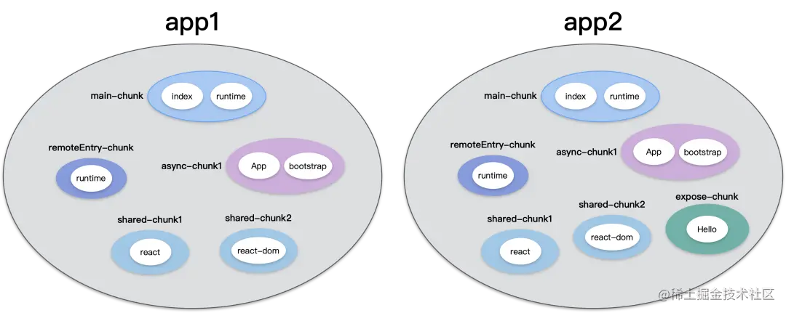

# 关于微前端的理解与实现

## 微前端概述

1. 什么是微前端(**what**)

微前端是一种类似于微服务的架构，是一种由独立交付的多个前端应用组成整体的架构风格，将前端应用分解成一些更小、更简单的能够独立开发、测试、部署的应用，而在用户看来仍然是内聚的单个产品。有一个基座应用（主应用），来管理各个子应用的加载和卸载。


微前端的三大核心原则：`独立开发`、`独立运行`、`独立部署`

2. 为什么要使用微前端(**why**)

- 2.1 拆分巨石应用

比如有一个巨大的应用，为了降低开发和维护成本，分拆成多个小应用进行开发和部署，然后用一个平台将这些小应用集成起来

- 2.2 整合其他系统

比如制作一个企业管理平台，把已有的采购系统和财务系统统一接入这个平台

- 2.3 允许单个团队做出技术决策

又比如一个应用使用vue框架开发，其中有一个比较独立的模块，开发者想尝试使用react框架来开发，等模块单独开发部署完，再把这个模块应用接回去

3. 如何实现微前端(**how**)

<!-- - 3.1 多个微应用如何进行组合？

在微前端架构中，除了存在多个微应用以外，还存在一个`容器应用`，每个微应用都需要被注册到容器应用中。

微前端中的每个应用在浏览器中都是一个独立的`JavaScript模块`，通过`模块化`的方式被容器应用启动和运行。

使用模块化的方式运行应用可以防止不同的微应用在同时运行时发生冲突。

- 3.2 在微应用中如何实现路由？

在微前端架构中，当路由发生变化时，容器应用首先会拦截路由的变化，根据路由匹配微前端应用，当匹配到微应用以后，再启动微应用路由，匹配具体的页面组件。

- 3.3 微应用与微应用之间如何实现状态共享？

在微应用中可以通过`发布订阅模式`实现状态共享

- 3.4 微应用与微应用之间如何实现框架和库的共享？

通过`import-map`和`webpack`中的`externals`属性。 -->

微前端的核心其实就是如何将各个应用进行整合，最容易想到的方案就是有个`容器应用`，然后通过`iframe`的形式进行将各个网页承载进来

`iframe`确实是实现微前端的一种方案，它的优点和缺点都很突出

::: tip 优点

- 非常简单，使用没有任何心智负担
- web应用隔离的非常完美，无论是js、css、dom都完全隔离开来

:::

::: danger 缺点

- 路由状态丢失，刷新一下，iframe的url状态就丢失了
- dom割裂严重，弹窗只能在iframe内部展示，无法覆盖全局
- web应用之间通信非常困难
- 每次打开白屏时间太长，对于SPA 应用来说无法接受

:::

基于以上，`iframe`在实现微前端的过程会变成非常的困难且体验不好，那么我们是否可以将每个网页都当成是一个`javascript`模块，通过`模块化`的方式导入和加载应用呢？

## 前置知识

### 模块化方案

- cjs(commonjs)

  `commonjs`是Node中的模块规范，通过`require`及`exports`进行导入导出 (进一步延伸的话，`module.exports`属于`commonjs2`)

  像`webpack`等打包工具运行在Node环境下，能够解析`cjs`模块，但是浏览器不能原生支持`cjs`模块

  比如，著名的全球下载量前10的模块[ms](https://npm.devtool.tech/ms)只支持`commonjs`，但并不影响它在前端项目中使用(比如通过`webpack`)，但是你想通过`cdn`的方式直接在浏览器中引入，估计就会出问题了

  ```js
  // sum.js
  exports.sum = (x, y) => x + y

  // index.js
  const { sum } = require("./sum.js")
  ```

  由于 cjs 为动态加载，可直接 require 一个变量

  ```js
  var a = 'moduleName'
  require(`./${a}`)
  ```

- esm (es module)

  `esm`是`tc39`对于`ECMAScript`的模块话规范，正因是语言层规范，因此在**Node及浏览器**中均会支持。

  它使用`import/export`进行模块导入导出.

  ```js
  // sum.js
  export const sum = (x, y) => x + y

  // index.js
  import { sum } from "./sum"
  ```

  `esm`为**静态导入**，正因如此，可在编译期进行`Tree Shaking`，减少 js 体积。

  如果需要**动态导入**，`tc39`为动态加载模块定义了API: `import(module)` 。可将以下代码粘贴到控制台执行

  ```js
  const ms = await import("https://cdn.skypack.dev/ms@latest")

  ms.default(1000)
  ```

  `esm`是未来的趋势，目前一些`CDN`厂商，前端构建工具均致力于`cjs`模块向`esm`的转化，比如`skypack`、`snowpack`、`vite`等。

  目前，在浏览器与 node.js 中均原生支持 esm。

  ::: tip
  - cjs 模块输出的是一个值的拷贝，esm 输出的是值的引用
  - cjs 模块是运行时加载，esm 是编译时加载（支持`Tree Shaking`）
  :::

  ::: details 关于编译时加载

  由于是编译时加载是静态分析，因此在`webpack`等打包工具中，不支持完全动态的`import`语句

  ```js
  // success
  import('./test.js').then()
  // error
  const foo = '/.test.js'
  import(foo).then()
  ```

  webpack官网中有以下描述：

  > It is not possible to use a fully dynamic import statement, such as import(foo). Because foo could potentially be any path to any file in your system or project..

  `import()`必须至少包含一些关于模块的路径信息。打包可以限定于一个特定的目录或文件集，以便于在使用动态表达式时 - 包括可能在`import()`调用中请求的每个模块。
  例如， import(`./locale/${language}.json`) 会把`.locale`目录中的每个`.json`文件打包到新的`chunk`中。在运行时，计算完变量`language`后，就可以使用像`english.json`或`german.json`的任何文件。

  ```js
  // 想象我们有一个从 cookies 或其他存储中获取语言的方法
  const language = detectVisitorLanguage();
  import(`./locale/${language}.json`).then((module) => {
    // do something with the translations
  });
  ```

  :::

- umd(Universal Module Definition)

  一种兼容`cjs`,`amd`,`cmd`的模块，既可以在`node/webpack`环境中被`require`引用，也可以在浏览器中直接用`CDN`被`script.src`引入。

  ```js
  (function(root, factory) {
    if (typeof module === 'object' && typeof module.exports === 'object') {
      console.log('是commonjs模块规范，nodejs环境')
      module.exports = factory(); // [!code focus]
    } else if (typeof define === 'function' && define.amd) {
      console.log('是AMD模块规范，如require.js')
      define(factory) // [!code focus]
    } else if (typeof define === 'function' && define.cmd) {
      console.log('是CMD模块规范，如sea.js')
      define(function(require, exports, module) {
        module.exports = factory() // [!code focus]
      })
    } else {
      console.log('没有模块环境，直接挂载在全局对象上')
      root.umdModule = factory(); // [!code focus]
    }
  }(this, function() {
    return {
      name: '我是一个umd模块'
    }
  }))
  ```

### Import Maps

在支持`type="module"`的浏览器中尝试写如下标签

```html
<script type="module">
  import { createApp } from "vue";
  import { partition } from "lodash";
</script>
```

这样写会报错，原因是在浏览器中，`import`必须给出`相对或绝对的URL路径`。没有任何路径的模块被称为`裸（bare）模块`。在`import`中不允许这种模块。

某些环境，像`Node.js`或者打包工具允许没有任何路径的裸模块，因为它们有自己查找模块的方法。但是浏览器尚不支持裸模块。

以下这样写也是可以的

```html
<script type="module">
  import { createApp } from "https://cdn.bootcdn.net/ajax/libs/vue/3.2.47/vue.esm-browser.js"
</script>
```

但是如果有了`Import Maps`

```html
<script type="importmap">
  {
    "imports": {
      "vue": "https://cdn.bootcdn.net/ajax/libs/vue/3.2.47/vue.esm-browser.js",
      "lodash": "/node_modules/lodash-es/lodash.js"
    }
  }
</script>

<script type="module">
  import { reactive, effect } from 'vue'
  import { partition } from 'lodash'
</script>
```

上面的写法就能被解析为：

```html
<script type="module">
  import vue from "https://cdn.bootcdn.net/ajax/libs/vue/3.2.47/vue.esm-browser.js"
  import { partition } from "/node_modules/lodash-es/lodash.js"
</script>
```

目前关于`Import Maps`的兼容性：

{data-zoomable}

可以看到`Firefox`直到`2022-12-13`才对`import maps`的特性予以支持！

## [SystemJS](https://github.com/systemjs/systemjs)

`SystemJS`是一个**动态模块加载器**，它能够将原生`ES modules`转换成[System.register module format](https://github.com/systemjs/systemjs/blob/main/docs/system-register.md)来兼容那么不支持原生模块的浏览器

简单点来说，就是有了`SystemJS`就可以在浏览器中使用各种模块化方式(包括`esm`,`cjs`,`amd`,`cmd`等)

也可以理解成`import maps`的`pollyfill`(当然systemjs不仅仅只支持这个功能)，甚至可以支持`IE11`

CDN引入

```html
<script src="https://cdn.jsdelivr.net/npm/systemjs/dist/system.js"></script>
```

引入主文件后，就可以使用了

```html
// systemjs也支持通过下面的方式定义资源 ，用来给资源定义一个key
<script type="systemjs-importmap">
  {
    "imports": {
      "vue": "https://cdn.bootcss.com/vue/2.6.11/vue.js"
    }
  }
</script>

<!-- 以下两种写法对于system-js来说是等价的 -->
<script type="systemjs-module" src="./entry.js"></script>
<script>System.import('/entry.js')</script>
```

::: info ===

Woo! 乍一看，这里的写法和浏览器原生的`import maps`完全一样！
实际上，`import maps`特性本身就是`systemjs`的作者给`Chrome`提的`feature`【作者youtube视频中提到】，而后才渐渐被各大浏览器实现
:::

由于`script`标签不使用`type="module"`而是使用`type="systemjs-module"`，浏览器并不认识`import`和`export`，因此需要对代码进行改造

::: code-group

```js [entry.js]
import Vue from 'vue'

new Vue({
  el: '#container',
  data: { name: 'levi' }
})
```

:::

改为以下代码

::: code-group

```js [entry.js]
import Vue from 'vue' // [!code --]

new Vue({ // [!code --]
  el: '#container', // [!code --]
  data: { name: 'levi' } // [!code --]
}) // [!code --]

System.register(['vue'], function () {
  let Vue = null
  return {
    setters: [(v) => (Vue = v.default)],
    execute() {
      new Vue({
        el: '#container',
        data: function () {
          return { name: 'levi' }
        }
      })
    }
  }
})
```

:::

### SystemJS工程配置示例

> blog中运行(**【需要本文章的源码仓库】**)

```bash
pnpm -F @levi/sj dev
```

::: code-group

<<< @/../../system-js/src/index.html

<<< @/../../system-js/src/index.js

<<< @/../../system-js/webpack.config.js{9,41,42}

:::

## [single-spa](https://single-spa.js.org/)

> `single-spa`推荐使用`浏览器内ES模块 + import maps` (或者`SystemJS`填充这些，如果你需要更好的浏览器支持)的设置

`single-spa`是一个将多个单页面应用聚合为一个整体应用的`JavaScript`微前端框架

::: warning
在使用single-spa时，不必使用SystemJS，不过为了能够独立部署各应用，很多示例和教程会推荐使用SystemJS。
:::

- 核心原理

在`基座 (主) 应用`中注册所有 App 的路由，single-spa 保存各子应用的路由映射关系，充当微前端控制器`Controller`，当对应的`URL`变换时，除了匹配`基座应用`本身的路由外，还会匹配`子应用`路由并加载渲染子应用


子应用会经过如下过程:

1. 下载 (loaded)
2. 初始化 (initialized)
3. 挂载 (mounted)
4. 卸载 (unmounted)

`single-spa` 还会通过**生命周期**为这些过程提供对应的**钩子函数**。

### single-spa配置实践

> blog中运行(**【需要本文章的源码仓库】**)

```bash
pnpm -F @levi/ss dev
```

### single-spa主应用配置

<<< @/../../single-spa/container/index.html

构建基座的核心是：配置子应用信息，通过`registerApplication`注册子应用，在基座工程挂载阶段`start`启动基座

### Vue子应用配置

::: code-group

<<< @/../../single-spa/app1/src/main.js

<<< @/../../single-spa/app1/vue.config.js

:::

### React 子应用配置

::: code-group

<<< @/../../single-spa/app2/src/index.js

<<< @/../../single-spa/app2/config/webpack.config.js#output

:::

::: details 为何要设置library?

webpack打包出来的代码默认是以下形式的

```js
(function() {
  var test = 1
  return {
    test
  }
})()
```

如果设置了library.name，就相当于以下代码

```js
var app2 = (function() {
  var test = 1
  return {
    test
  }
})()
```

因此就可以直接访问`window.app2`

:::

在上述demo中，存在着几个比较明显的缺陷：

- `js`全局环境被污染了(`window.levi`)
- `css`没有做到隔离(`.test类`)
- 需要手动引入各个资源(`app方法`)

## [qiankun](https://qiankun.umijs.org/zh/guide)

`qiankun`是一个基于`single-spa`的微前端实现库，目的是提供更简单、无痛的构建一个生产可用微前端架构系统。

那么我们有`single-spa`这种微前端解决方案，为什么还需要`qiankun`呢?

相比于`single-spa`，`qiankun`他解决了**JS沙盒环境**，**CSS沙箱环境**，不需要我们自己去进行处理。
在`single-spa`的开发过程中，我们需要自己手动的去写调用子应用JS的方法（如上面的`createScript`方法），而`qiankun`不需要，乾坤只需要你传入响应的apps的配置即可，会帮助我们去加载。

### qiankun主应用配置

::: code-group

```ts [registerApplication.ts]
import { registerMicroApps, start } from 'qiankun';

registerMicroApps([
  {
    name: 'reactApp',
    entry: '//localhost:3000',
    container: '#container',
    activeRule: '/app-react',
  },
  {
    name: 'vueApp',
    entry: '//localhost:8080',
    container: '#container',
    activeRule: '/app-vue',
  },
  {
    name: 'angularApp',
    entry: '//localhost:4200',
    container: '#container',
    activeRule: '/app-angular',
  },
]);
// 启动 qiankun
start();
```

:::

### react16子应用配置

::: code-group

```js [src/public-path.js]
if (window.__POWERED_BY_QIANKUN__) {
  __webpack_public_path__ = window.__INJECTED_PUBLIC_PATH_BY_QIANKUN__;
}
```

```js [app.js]
<BrowserRouter basename={window.__POWERED_BY_QIANKUN__ ? '/app-react' : '/'}>
```

```js [index/js]
import './public-path';
import React from 'react';
import ReactDOM from 'react-dom';
import App from './App';

function render(props) {
  const { container } = props;
  ReactDOM.render(<App />, container ? container.querySelector('#root') : document.querySelector('#root'));
}

if (!window.__POWERED_BY_QIANKUN__) {
  render({});
}

export async function bootstrap() {
  console.log('[react16] react app bootstraped');
}

export async function mount(props) {
  console.log('[react16] props from main framework', props);
  render(props);
}

export async function unmount(props) {
  const { container } = props;
  ReactDOM.unmountComponentAtNode(container ? container.querySelector('#root') : document.querySelector('#root'));
}
```

```js [config/webpack.config.js]
const { name } = require('./package');

module.exports = {
  webpack: (config) => {
    config.output.library = `${name}-[name]`;
    config.output.libraryTarget = 'umd';
    config.output.jsonpFunction = `webpackJsonp_${name}`;
    config.output.globalObject = 'window';

    return config;
  },

  devServer: (_) => {
    const config = _;

    config.headers = {
      'Access-Control-Allow-Origin': '*',
    };
    config.historyApiFallback = true;
    config.hot = false;
    config.watchContentBase = false;
    config.liveReload = false;

    return config;
  }
};
```

:::

### vue2子应用配置

::: code-group

```js [src/public-path.js]
if (window.__POWERED_BY_QIANKUN__) {
  __webpack_public_path__ = window.__INJECTED_PUBLIC_PATH_BY_QIANKUN__;
}
```

```js [main.js]
import './public-path';
import Vue from 'vue';
import VueRouter from 'vue-router';
import App from './App.vue';
import routes from './router';
import store from './store';

Vue.config.productionTip = false;

let router = null;
let instance = null;
function render(props = {}) {
  const { container } = props;
  router = new VueRouter({
    base: window.__POWERED_BY_QIANKUN__ ? '/app-vue/' : '/',
    mode: 'history',
    routes,
  });

  instance = new Vue({
    router,
    store,
    render: (h) => h(App),
  }).$mount(container ? container.querySelector('#app') : '#app');
}

// 独立运行时
if (!window.__POWERED_BY_QIANKUN__) {
  render();
}

export async function bootstrap() {
  console.log('[vue] vue app bootstraped');
}
export async function mount(props) {
  console.log('[vue] props from main framework', props);
  render(props);
}
export async function unmount() {
  instance.$destroy();
  instance.$el.innerHTML = '';
  instance = null;
  router = null;
}
```

```js [vue.config.js]
const { name } = require('./package');
module.exports = {
  devServer: {
    headers: {
      'Access-Control-Allow-Origin': '*',
    },
  },
  configureWebpack: {
    output: {
      library: `${name}-[name]`,
      libraryTarget: 'umd', // 把微应用打包成 umd 库格式
      jsonpFunction: `webpackJsonp_${name}`,
    },
  },
};
```

:::

### 核心原理解析

- 路由劫持

  `qiankun`的路由劫持主要还是通过`single-spa`，这里以后做讲述

- 加载子应用

  在讲述`single-spa`的章节中有介绍，要在基座应用中注册子应用，需要制定每个子应用对应的`url`，以及如何加载子应用依赖的`js`文件等，

  相比于`single-spa`，我们发现`qiankun`加载子应用的时候不需要指定子应用依赖的`js`文件，只需要指定`entry`就可以，那么它是如何实现的呢？

  其实就是通过[html-import-entry](https://github.com/kuitos/import-html-entry)加载并解析子应用的HTML

  在基座应用中通过调用 `registerMicroApps(...)` 函数注册子应用时，其内部实际上是通过`single-spa`中的`registerApplication(...)`函数来实现的，其内容如下：

  ::: code-group

  ```ts [qiankun\src\apis.ts]
  import {
    mountRootParcel,
    registerApplication, // [!code hl]
    start as startSingleSpa
  } from 'single-spa'
  import { loadApp } from './loader'

  export function registerMicroApps<T extends ObjectType>(
    apps: Array<RegistrableApp<T>>,
    lifeCycles?: FrameworkLifeCycles<T>
  ) {
    // 每个子应用只会被注册一次
    const unregisteredApps = apps.filter((app) => {
      return !microApps.some((registeredApp) => registeredApp.name === app.name)
    })

    microApps = [...microApps, ...unregisteredApps]

    unregisteredApps.forEach((app) => {
      const { name, activeRule, loader = noop, props, ...appConfig } = app

      // 真正注册子应用的地方，通过 loadApp 加载并解析子应用对应的 html 模板
      registerApplication({ // [!code hl]
        name,
        app: async () => {
          loader(true)
          await frameworkStartedDefer.promise

          const { mount, ...otherMicroAppConfigs } = (
            await loadApp(  // [!code hl]
              { name, props, ...appConfig },  // [!code hl]
              frameworkConfiguration,  // [!code hl]
              lifeCycles  // [!code hl]
            )  // [!code hl]
          )()

          return {
            mount: [
              async () => loader(true),
              ...toArray(mount),
              async () => loader(false)
            ],
            ...otherMicroAppConfigs
          }
        },
        activeWhen: activeRule,
        customProps: props
      })
    })
  }

  ```

  ```ts [qiankun\src\loader.ts]
  import { importEntry } from 'import-html-entry';

  export async function loadApp<T extends ObjectType>(
    app: LoadableApp<T>,
    configuration: FrameworkConfiguration = {},
    lifeCycles?: FrameworkLifeCycles<T>,
  ): Promise<ParcelConfigObjectGetter> {
    const { entry, name: appName } = app;
    ...
    const {
      singular = false,
      sandbox = true,
      excludeAssetFilter,
      globalContext = window,
      ...importEntryOpts
    } = configuration;

    // get the entry html content and script executor
    const {
      template,
      execScripts,
      assetPublicPath
    } = await importEntry(entry, importEntryOpts); // [!code hl]
    ...
  }
  ```

  :::

  我们再来看`importEntry`做了什么

  ::: code-group

  ```ts [import-html-entry/src/index.js]
  export function importEntry(entry, opts = {}) {
    const { fetch = defaultFetch, getTemplate = defaultGetTemplate, postProcessTemplate } = opts
    const getPublicPath = opts.getPublicPath || opts.getDomain || defaultGetPublicPath

    if (!entry) {
      throw new SyntaxError('entry should not be empty!')
    }

    // html entry

    // 这里的entry的schema如下
    // string | { scripts?: string[]; styles?: string[]; html?: string }
    if (typeof entry === 'string') {
      return importHTML(entry, { // [!code hl]
        fetch, // [!code hl]
        getPublicPath, // [!code hl]
        getTemplate, // [!code hl]
        postProcessTemplate // [!code hl]
      }) // [!code hl]
    }

    // config entry
    if (Array.isArray(entry.scripts) || Array.isArray(entry.styles)) {
      ...
    } else {
      throw new SyntaxError('entry scripts or styles should be array!')
    }
  }

  // 已经嵌入的html缓存
  const embedHTMLCache = {};
  export default function importHTML(url, opts = {}) {
    // 不传入任何值得话就是使用的window.fetch
    let fetch = defaultFetch
    ...
    return (
      embedHTMLCache[url] ||
      (embedHTMLCache[url] = fetch(url)
        .then((response) => readResAsString(response, autoDecodeResponse))
        .then((html) => {
          const assetPublicPath = getPublicPath(url)
          // 解析html内容
          const {
            template,
            scripts,
            entry,
            styles
          } = processTpl(getTemplate(html), assetPublicPath, postProcessTemplate) // [!code hl]

          return getEmbedHTML(template, styles, { fetch }).then((embedHTML) => ({
            template: embedHTML,
            assetPublicPath,
            getExternalScripts: () => getExternalScripts(scripts, fetch),
            getExternalStyleSheets: () => getExternalStyleSheets(styles, fetch),
            execScripts: (proxy, strictGlobal, opts = {}) => {
              if (!scripts.length) {
                return Promise.resolve()
              }
              return execScripts(entry, scripts, proxy, {
                fetch,
                strictGlobal,
                ...opts
              })
            }
          }))
        }))
    )
  }
  ```

  :::

  这里的核心是`processTpl`，我们继续来看`processTpl`究竟做了什么

  ::: code-group

  ```ts [import-html-entry/src/process-tpl.js]
  export const genIgnoreAssetReplaceSymbol = url =>
  `<!-- ignore asset ${url || 'file'} replaced by import-html-entry -->`;

  // 这里的tpl就是html字符串
  export default function processTpl(tpl, baseURI, postProcessTemplate) {
    let scripts = [];
    const styles = [];
    let entry = null;
    const temp = tpl
      // 移除注释
      .replace(HTML_COMMENT_REGEX, '')
      .replace(LINK_TAG_REGEX, match => {
        // 修改css link
        ...
        return match
      })
      .replace(STYLE_TAG_REGEX, match => {
        // 处理style标签
        ...
        return match
      })
      .replace(ALL_SCRIPT_REGEX, (match, scriptTag) => {
        ...
        // 如果是外部标签
        if (SCRIPT_TAG_REGEX.test(match) && scriptTag.match(SCRIPT_SRC_REGEX)) {
          if (matchedScriptSrc) {
            const asyncScript = !!scriptTag.match(SCRIPT_ASYNC_REGEX);
            ...
            scripts.push( // [!code hl]
              asyncScript ?  // [!code hl]
                { async: true, src: matchedScriptSrc } :  // [!code hl]
                matchedScriptSrc // [!code hl]
            ); // [!code hl]
            return genScriptReplaceSymbol(matchedScriptSrc, asyncScript);
          }
        } else {
          // 如果是内联标签，获取标签内容
          const code = getInlineCode(match)
          // 当标签内部全是注释的时候，就不要了
          const isPureCommentBlock = code.split(/[\r\n]+/).every(line => {
            return !line.trim() || line.trim().startsWith('//')
          });
          if (!isPureCommentBlock) {
            scripts.push(match);  // [!code hl]
          }
          return inlineScriptReplaceSymbol;
        }

      })

    scripts = scripts.filter(function (script) {
      // filter empty script
      return !!script;
    });

    let tplResult = {
      template,
      scripts,
      styles,
      // set the last script as entry if have not set
      entry: entry || scripts[scripts.length - 1],
    };
    ...
    return tplResult;
  }
  ```

  :::

  最终在执行的时候，都是通过`evalCode`函数运行`js`代码

  ::: code-group

  ```js [import-html-entry/src/utils.js]
  // 缓存
  const evalCache = {};
  export function evalCode(scriptSrc, code) {
    const key = scriptSrc
    if (!evalCache[key]) {
      const functionWrappedCode = `(function(){${code}})`
      evalCache[key] = (0, eval)(functionWrappedCode) // [!code hl]
    }
    const evalFunc = evalCache[key]
    evalFunc.call(window)
  }
  ```

  :::

  > 最终我们发现，乾坤大致就是通过`window.fetch(可自定义)`获取入口`html`文件，通过一系列的正则表达式，解析`html`字符串中的内容，生成`scripts`、`styles`和`template`，最终通过`eval`函数来执行求中的`js`代码

  细心的小伙伴一定发现了一个问题，那就是`eval`**不支持**`export`和`import`！

  不支持`export`和`import`，也就意味着`qiankun`**不支持**像`vite`和`snowpack`这类打包工具构建的项目！

  随着`vite`的火热发展，越来越多的开发者开始使用`vite`构建项目，该问题无疑是限制了`qiankun`的发展

  在`qiankun`的`discussions`栏目有一个有趣的讨论[qiankun 3.0 Roadmap](https://github.com/umijs/qiankun/discussions/1378)

  自2021年4月份依赖，`qiankun 3.0`完成的唯一一件事就是设计了一个新`logo` ~

- 沙箱隔离

  `沙箱`的目的是为了隔离子应用间`脚本`和`样式`的影响，即需要针对子应用的`<style>`、`<link>`、`<script>`等类型的标签进行特殊处理，而处理时机分为两种

  1. 在`初始化加载`时，因为初始化加载子应用时，需要加载其对应的`脚本和样式`
  2. 在子应用正在`运行时`，因为子应用运行时可能会`动态添加脚本和样式`(例如`vue-router`中`路由懒加载`，都是运行时才会加载对应的脚本)

  - 重写`appendChild`、`insertBefore`、`removeChild`等原生方法

    以便于可以监听`新添加/删除`的节点，并对`<style>`、`<link>`、`<script>`等标签进行处理。

    ::: code-group [qiankun\src\sandbox\patchers\dynamicAppend\common.ts]

    ```ts [qiankun\src\sandbox\patchers\dynamicAppend\common.ts]
    export function patchHTMLDynamicAppendPrototypeFunctions(
      isInvokedByMicroApp: (element: HTMLElement) => boolean,
      containerConfigGetter: (element: HTMLElement) => ContainerConfig
    ) {
      // 只在 appendChild 和 insertBefore 没有被重写时进行重写
      if (
        HTMLHeadElement.prototype.appendChild === rawHeadAppendChild &&
        HTMLBodyElement.prototype.appendChild === rawBodyAppendChild &&
        HTMLHeadElement.prototype.insertBefore === rawHeadInsertBefore
      ) {
        // 重写方法
        HTMLHeadElement.prototype.appendChild = getOverwrittenAppendChildOrInsertBefore({
          rawDOMAppendOrInsertBefore: rawHeadAppendChild,
          containerConfigGetter,
          isInvokedByMicroApp,
          target: 'head'
        }) as typeof rawHeadAppendChild

        // 重写方法
        HTMLBodyElement.prototype.appendChild = getOverwrittenAppendChildOrInsertBefore(...) as typeof rawBodyAppendChild

        // 重写方法
        HTMLHeadElement.prototype.insertBefore = getOverwrittenAppendChildOrInsertBefore(...) as typeof rawHeadInsertBefore
      }

      // 只在 removeChild 没有被重写时进行重写
      if (
        HTMLHeadElement.prototype.removeChild === rawHeadRemoveChild &&
        HTMLBodyElement.prototype.removeChild === rawBodyRemoveChild
      ) {
        // 重写方法
        HTMLHeadElement.prototype.removeChild = getNewRemoveChild(rawHeadRemoveChild, containerConfigGetter, 'head')
        HTMLBodyElement.prototype.removeChild = getNewRemoveChild(rawBodyRemoveChild, containerConfigGetter, 'body')
      }

      // 恢复重写前的方法
      return function unpatch() {
        HTMLHeadElement.prototype.appendChild = rawHeadAppendChild
        ...
      }
    }
    ```

    :::

  - css沙箱隔离

    - `shadowDom`实现隔离
    - `prefix`限定`CSS`规则

  - js沙箱隔离

    - `LegacySandbox`
    - `ProxySandbox`
    - `SnapshotSandbox`

- 应用通信

  `qiankun`中应用通信可以通过[initGlobalState(state)](https://qiankun.umijs.org/zh/api#initglobalstatestate)的方式实现，它用于定义全局状态，并返回通信方法，官方建议在主应用使用，微应用通过`props`获取通信方法。

  ::: code-group

  ```ts [qiankun/src/globalState.ts]
  let globalState: Record<string, any> = {}

  const deps: Record<string, OnGlobalStateChangeCallback> = {}

  // 触发全局监听
  function emitGlobal(state: Record<string, any>, prevState: Record<string, any>) {
    Object.keys(deps).forEach((id: string) => {
      if (deps[id] instanceof Function) {
        deps[id](cloneDeep(state), cloneDeep(prevState))
      }
    })
  }

  export function initGlobalState(state: Record<string, any> = {}) {
    ...
    const prevGlobalState = cloneDeep(globalState)
    globalState = cloneDeep(state)
    emitGlobal(globalState, prevGlobalState)

    return getMicroAppStateActions(`global-${+new Date()}`, true)
  }

  export function getMicroAppStateActions(id: string, isMaster?: boolean): MicroAppStateActions {
    return {

      // 全局依赖监听
      onGlobalStateChange(callback: OnGlobalStateChangeCallback, fireImmediately?: boolean) {
        deps[id] = callback
        if (fireImmediately) {
          const cloneState = cloneDeep(globalState)
          callback(cloneState, cloneState)
        }
      },
      // setGlobalState 更新 store 数据
      setGlobalState(state: Record<string, any> = {}) {
        const changeKeys: string[] = []
        const prevGlobalState = cloneDeep(globalState)
        globalState = cloneDeep(
          Object.keys(state).reduce((_globalState, changeKey) => {
            if (isMaster || _globalState.hasOwnProperty(changeKey)) {
              changeKeys.push(changeKey)
              return Object.assign(_globalState, { [changeKey]: state[changeKey] })
            }
            return _globalState
          }, globalState)
        )
        emitGlobal(globalState, prevGlobalState)
        return true
      },

      // 注销该应用下的依赖
      offGlobalStateChange() {
        delete deps[id]
        return true
      }
    }
  }
  ```

  :::

  其实不用翻开源码，大家也能明白这就是妥妥的`发布订阅模式`

  它和我们在`vue2`中使用的`EventBus`核心原理其实是一样的，只不过做了一些应用场景的边界判断

## [Module Federation](https://webpack.js.org/concepts/module-federation/)

`Module Federation`是`webpack5`所提供的功能，中文直译为`模块联邦`，而在webpack官方文档中，其实并未给出其真正含义，但给出了使用该功能的`motivation`，即动机，原文如下：

> Multiple separate builds should form a single application. These separate builds should not have dependencies between each other, so they can be developed and deployed individually.
> This is often known as Micro-Frontends, but is not limited to that.

翻译成中文即

> 多个独立的构建可以形成一个应用程序。这些独立的构建不会相互依赖，因此可以单独开发和部署它们。这通常被称为微前端，但并不仅限于此。

结合以上，不难看出，`mf`实际想要做的事，便是把多个无相互依赖、单独部署的应用合并为一个。通俗点讲，即`mf`提供了能在当前应用中远程加载其他服务器上应用的能力。对此，可以引出下面两个概念：

- **host**：引用了其他应用的应用
- **remote**：被其他应用所使用的应用


鉴于`mf`的能力，我们可以完全实现一个**去中心化**的应用部署群：每个应用是单独部署在各自的服务器，每个应用都可以引用其他应用，也能被其他应用所引用，即每个应用可以充当`host`的角色，亦可以作为`remote`出现，`无中心应用`的概念。



我们再来看看`webpack5`与之前版本的模块管理对比图，以助于更好的理解

webpack5之前



webpack5


### 基本配置介绍

::: code-group

```js [webpack.config.js]
const HtmlWebpackPlugin = require("html-webpack-plugin");
const ModuleFederationPlugin = require("webpack/lib/container/ModuleFederationPlugin");

module.exports = {
  plugins: [
    new ModuleFederationPlugin({
      // 必传值，即输出的模块名，被远程引用时路径为${name}/${expose}
      name: 'leviBase',
      // 声明全局变量的方式，name为umd的name
      library: { type: 'var', name: 'leviBase' },
      // 构建输出的文件名
      filename: 'levi.js',
      // 远程引用的应用名及其别名的映射，使用时以key值作为name
      remotes: {
        app_two: "app_two_remote",
        app_three: "app_three_remote"
      },
      // 被远程引用时可暴露的资源路径及其别名
      exposes: {
        './Component1': 'src/components/Component1',
        './Component2': 'src/components/Component2',
      },
      // 与其他应用之间可以共享的第三方依赖，使你的代码中不用重复加载同一份依赖
      shared: ["react", "react-dom","react-router-dom"]
    })
  ]
}
```

:::

### Module Federation配置实践

> blog中运行(**【需要本文章的源码仓库】**)

```bash
pnpm -F @levi/mf dev
```

<div class="filename">container</div>

::: code-group

<<< @/../../module-federation/container/src/index.js

<<< @/../../module-federation/container/src/bootstrap.js

<<< @/../../module-federation/container/webpack.config.js

:::

<div class="filename">products</div>

::: code-group

<<< @/../../module-federation/products/src/index.js

<<< @/../../module-federation/products/src/bootstrap.js

<<< @/../../module-federation/products/webpack.config.js

:::

<div class="filename">cart</div>

::: code-group

<<< @/../../module-federation/cart/src/index.js

<<< @/../../module-federation/cart/src/bootstrap.js

<<< @/../../module-federation/cart/webpack.config.js

:::

### 构建后的代码解析

```js
var moduleMap = {
  "./index": function() {
    return Promise.all([
      __webpack_require__.e("..."),
      __webpack_require__.e("...")
    ]).then(function() { return function() { return (__webpack_require__(16499)); }; });
  },
  "./test": function() {
    ...
  }
};
var get = function(module, getScope) {
  __webpack_require__.R = getScope;
  getScope = (
    __webpack_require__.o(moduleMap, module)
    ? moduleMap[module]()
    : Promise.resolve().then(function() {
      throw new Error('Module "' + module + '" does not exist in container.');
    })
  );
  __webpack_require__.R = undefined;
  return getScope;
};
var init = function(shareScope, initScope) {
  if (!__webpack_require__.S) return;
  var oldScope = __webpack_require__.S["default"];
  var name = "default"
  if(oldScope && oldScope !== shareScope) throw new Error("Container initialization failed as it has already been initialized with a different share scope");
  __webpack_require__.S[name] = shareScope;
  return __webpack_require__.I(name, initScope);
}
```

可以看到，代码中包括三个部分:

- moduleMap：通过`exposes`生成的模块集合
- get: `host`通过该函数，可以拿到`remote`中的组件
- init：`host`通过该函数将依赖注入`remote`中

再看moduleMap，返回对应组件前，先通过`__webpack_require__.e`加载了其对应的依赖，让我们看看`__webpack_require__.e`做了什么:

```js
__webpack_require__.f = {};
// This file contains only the entry chunk.
// The chunk loading function for additional chunks
__webpack_require__.e = function(chunkId) {
  // 获取__webpack_require__.f中的依赖
  return Promise.all(Object.keys(__webpack_require__.f).reduce(function(promises, key) {
    __webpack_require__.f[key](chunkId, promises);
    return promises;
  }, []));
};

__webpack_require__.f.consumes = function(chunkId, promises) {
  // 检查当前需要加载的chunk是否是在配置项中被声明为shared共享资源，
  // 如果在__webpack_require__.o上能找到对应资源，则直接使用，不再去请求资源
  if(__webpack_require__.o(chunkMapping, chunkId)) {
    chunkMapping[chunkId].forEach(function(id) {
      if(__webpack_require__.o(installedModules, id)) return promises.push(installedModules[id]);
      var onFactory = function(factory) {
        installedModules[id] = 0;
        __webpack_modules__[id] = function(module) {
          delete __webpack_module_cache__[id];
          module.exports = factory();
        }
      };
      try {
        var promise = moduleToHandlerMapping[id]();
        if(promise.then) {
          promises.push(installedModules[id] = promise.then(onFactory).catch(onError));
        } else onFactory(promise);
      } catch(e) { onError(e); }
    });
  }
}

// 这里就是动态加载运行时chunk的逻辑了，核心就是动态创建script标签 // [!code hl]
__webpack_require__.l = (url, done, key, chunkId) => {
  if(inProgress[url]) { inProgress[url].push(done); return; }
  var script, needAttach;
  if(key !== undefined) {
    var scripts = document.getElementsByTagName("script");
    for(var i = 0; i < scripts.length; i++) {
      var s = scripts[i];
      if(s.getAttribute("src") == url || s.getAttribute("data-webpack") == dataWebpackPrefix + key) { script = s; break; }
    }
  }
  if(!script) {
    needAttach = true;
    script = document.createElement('script');
    script.charset = 'utf-8';
    script.timeout = 120;
    if (__webpack_require__.nc) {
      script.setAttribute("nonce", __webpack_require__.nc);
    }
    script.setAttribute("data-webpack", dataWebpackPrefix + key);
    script.src = url;
  }
  inProgress[url] = [done];
  var onScriptComplete = (prev, event) => {
    // avoid mem leaks in IE.
    script.onerror = script.onload = null;
    clearTimeout(timeout);
    var doneFns = inProgress[url];
    delete inProgress[url];
    script.parentNode && script.parentNode.removeChild(script);
    doneFns && doneFns.forEach((fn) => (fn(event)));
    if(prev) return prev(event);
  };
  var timeout = setTimeout(onScriptComplete.bind(null, undefined, { type: 'timeout', target: script }), 120000);
  script.onerror = onScriptComplete.bind(null, script.onerror);
  script.onload = onScriptComplete.bind(null, script.onload);
  needAttach && document.head.appendChild(script);
};
```

通读核心代码之后，可以得到如下总结：

- 首先，`mf`会让`webpack`以`filename`作为文件名生成文件
- 其次，文件中以`var`的形式暴露了一个名为`name`的全局变量，其中包含了`exposes`以及`shared`中配置的内容
- 最后，作为`host`时，先通过`remote`的`init`方法将自身`shared`写入`remote`中，再通过`get`获取`remote`中`expose`的组件。
而作为`remote`时，判断`host`中是否有可用的共享依赖，若有，则加载`host`的这部分依赖，若无，则加载自身依赖。

### 应用场景

英雄也怕无用武之地，让我们看看mf的应用场景有哪些

- 微前端：通过`shared`以及`exposes`可以将多个应用引入同一应用中进行管理，由YY业务中台web前端组团队自主研发的`EMP微前端方案`就是基于`mf`的能力而实现的。
- 资源复用，减少编译体积：可以将多个应用都用到的通用组件单独部署，通过`mf`的功能在`runtime`时引入到其他项目中，这样组件代码就不会编译到项目中，同时亦能满足多个项目同时使用的需求，一举两得。

## 自己实现微前端框架

- ### 路由劫持

  ::: code-group

  <<< @/../../test-micro-web/src/router/rewriteRouter.js

  <<< @/../../test-micro-web/src/util/index.js {3-13}

  :::

- ### 加载子应用

  - 加载html资源

    <<< @/../../test-micro-web/src/util/fetchResources.js

  - 解析html资源

    <<< @/../../test-micro-web/src/htmlLoader/htmlLoader.js

  - 执行js脚本

    <<< @/../../test-micro-web/src/sandbox/performScript.js {18-33}

- ### 沙箱隔离

  - js沙箱隔离

    - 快照沙箱

      <<< @/../../test-micro-web/src/sandbox/snapshotSandBox.js

    - 代理沙箱

      <<< @/../../test-micro-web/src/sandbox/proxySandBox.js

    - 代码自查

      避免操作`window`对象

  - css隔离

    - shadowDom

      <<< @/public/demos/shadow-dom.html

      <iframe width="100%" src="/demos/shadow-dom.html"></iframe>

    - prefix css（框架处理或者团队做约束）
    - [BEM](https://bemcss.com/) （团队做好约束）

      ```css
      .table {}
      .table__header {}
      .table__body {}
      .button--success {}
      .button--error {}
      ```

    - style scoped （团队做好约束）

      ```vue
      <style scoped>
      .red {
        color: red;
      }
      </style>
      ```

    - css in js

      - emotion

        ```jsx
        /** @jsx jsx */
        import { jsx } from '@emotion/react'

        let SomeComponent = props => {
          return (
            <div
              css={{
                color: 'hotpink'
              }}
              {...props}
            />
          )
        }
        ```

      - styled-components

        ```tsx
        const Button = styled.button`
          color: grey;
        `;
        ```

    - css modules

      ::: code-group

      ```jsx
      import styles from "./Header.module.css";

      export default function Header() {
        return <h2 className={styles.title}>Header 组件</h2>;
      }
      ```

      ```js [webpack.config.js]
      module.exports = {
        module: {
          rules: [
            {
              test: /\.(cs|scs)s$/,
              use: [MiniCssExtractPlugin.loader, {
                loader: 'css-loader',
                options: {
                  module: true // [!code hl]
                }
              }]
            }
          ]
        }
      }
      ```

      :::

    - 使用`minicss` MiniCssExtractPlugin

      使用的是MiniCssExtractPlugin将css文件打包成单独的文件，由于在是在子应用中加载link标签，所以子应用卸载之后link也会消失，实现了沙箱隔离

      但是同时加载多个子应用也会有缺陷

- ### 应用通信

  - props
  - customevent

    <<< @/../../test-micro-web/src/event/index.js

## 当前比较成熟的微前端方案

- 基于`single-spa`的 [qiankun](https://qiankun.umijs.org/zh/guide)
- 基于`module-federation`的 [EMP](https://github.com/efoxTeam/emp)
- 基于`webComponents`的 [micro-app](https://micro-zoe.github.io/micro-app/)
- 基于`webComponents`+`iframe`的 [wujie](https://wujie-micro.github.io/doc/)
