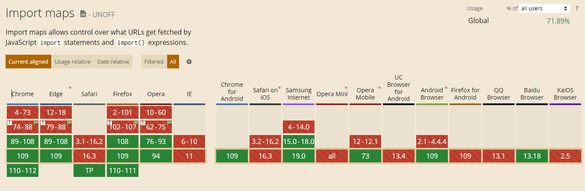
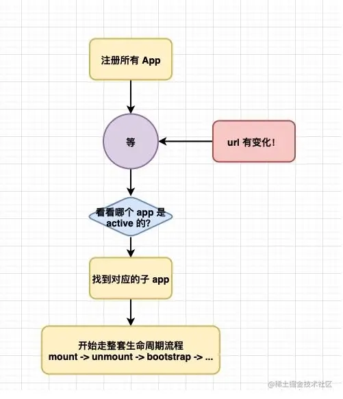
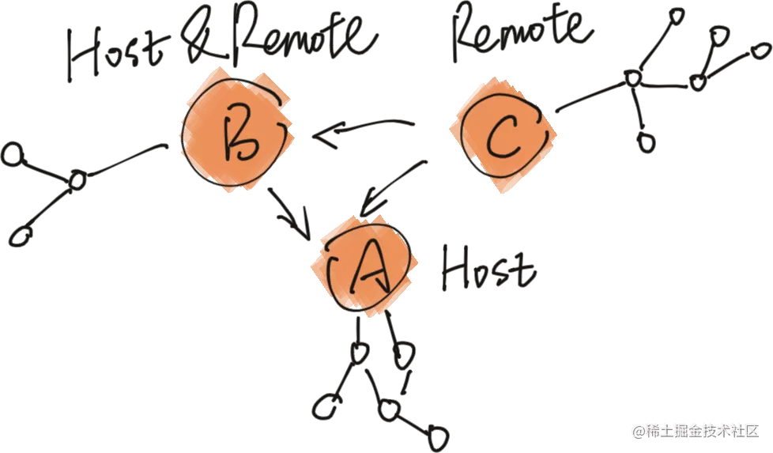

# 关于微前端的理解与实现

## 微前端概述

1. 什么是微前端(**what**)

微前端是一种类似于微服务的架构，是一种由独立交付的多个前端应用组成整体的架构风格，将前端应用分解成一些更小、更简单的能够独立开发、测试、部署的应用，而在用户看来仍然是内聚的单个产品。有一个基座应用（主应用），来管理各个子应用的加载和卸载。


微前端的三大核心原则：`独立开发`、`独立运行`、`独立部署`

2. 为什么要使用微前端(**why**)

- 2.1 拆分巨石应用

比如有一个巨大的应用，为了降低开发和维护成本，分拆成多个小应用进行开发和部署，然后用一个平台将这些小应用集成起来

- 2.2 整合其他系统

比如制作一个企业管理平台，把已有的采购系统和财务系统统一接入这个平台

- 2.3 允许单个团队做出技术决策

又比如一个应用使用vue框架开发，其中有一个比较独立的模块，开发者想尝试使用react框架来开发，等模块单独开发部署完，再把这个模块应用接回去

3. 如何使用微前端(**how**)

- 3.1 多个微应用如何进行组合？

在微前端架构中，除了存在多个微应用以外，还存在一个`容器应用`，每个微应用都需要被注册到容器应用中。

微前端中的每个应用在浏览器中都是一个独立的`JavaScript模块`，通过`模块化`的方式被容器应用启动和运行。

使用模块化的方式运行应用可以防止不同的微应用在同时运行时发生冲突。

- 3.2 在微应用中如何实现路由？

在微前端架构中，当路由发生变化时，容器应用首先会拦截路由的变化，根据路由匹配微前端应用，当匹配到微应用以后，再启动微应用路由，匹配具体的页面组件。

- 3.3 微应用与微应用之间如何实现状态共享？

在微应用中可以通过`发布订阅模式`实现状态共享

- 3.4 微应用与微应用之间如何实现框架和库的共享？

通过`import-map`和`webpack`中的`externals`属性。

## 前置知识

### 模块化方案

- cjs(commonjs)

  `commonjs`是Node中的模块规范，通过`require`及`exports`进行导入导出 (进一步延伸的话，`module.exports`属于`commonjs2`)

  像`webpack`等打包工具运行在Node环境下，能够解析`cjs`模块，但是浏览器不能原生支持`cjs`模块

  比如，著名的全球下载量前10的模块[ms](https://npm.devtool.tech/ms)只支持`commonjs`，但并不影响它在前端项目中使用(比如通过`webpack`)，但是你想通过`cdn`的方式直接在浏览器中引入，估计就会出问题了

  ```js
  // sum.js
  exports.sum = (x, y) => x + y

  // index.js
  const { sum } = require("./sum.js")
  ```

  由于 cjs 为动态加载，可直接 require 一个变量

  ```js
  var a = 'moduleName'
  require(`./${a}`)
  ```

- esm (es module)

  `esm`是`tc39`对于`ECMAScript`的模块话规范，正因是语言层规范，因此在**Node及浏览器**中均会支持。

  它使用`import/export`进行模块导入导出.

  ```js
  // sum.js
  export const sum = (x, y) => x + y

  // index.js
  import { sum } from "./sum"
  ```

  `esm`为**静态导入**，正因如此，可在编译期进行`Tree Shaking`，减少 js 体积。

  如果需要**动态导入**，`tc39`为动态加载模块定义了API: `import(module)` 。可将以下代码粘贴到控制台执行

  ```js
  const ms = await import("https://cdn.skypack.dev/ms@latest")

  ms.default(1000)
  ```

  esm 是未来的趋势，目前一些 CDN 厂商，前端构建工具均致力于 cjs 模块向 esm 的转化，比如 skypack、 snowpack、vite 等。

  目前，在浏览器与 node.js 中均原生支持 esm。

  ::: tip
  - cjs 模块输出的是一个值的拷贝，esm 输出的是值的引用
  - cjs 模块是运行时加载，esm 是编译时加载（支持`Tree Shaking`）
  :::

  ::: details 关于编译时加载

  由于是编译时加载是静态分析，因此不支持动态导入

  ```js
  // success
  import('./test.js').then()
  // error
  const foo = '/.test.js'
  import(foo).then()
  ```

  webpack官网中有以下描述：

  > 不能使用完全动态的 import 语句，例如 import(foo)。是因为 foo 可能是系统或项目中任何文件的任何路径。

  import() 必须至少包含一些关于模块的路径信息。打包可以限定于一个特定的目录或文件集，以便于在使用动态表达式时 - 包括可能在 import() 调用中请求的每个模块。
  例如， import(`./locale/${language}.json`) 会把 .locale 目录中的每个 .json 文件打包到新的 chunk 中。在运行时，计算完变量 language 后，就可以使用像 english.json 或 german.json 的任何文件。

  ```js
  // 想象我们有一个从 cookies 或其他存储中获取语言的方法
  const language = detectVisitorLanguage();
  import(`./locale/${language}.json`).then((module) => {
    // do something with the translations
  });
  ```

  :::

- umd(Universal Module Definition)

  一种兼容`cjs`,`amd`,`cmd`的模块，既可以在`node/webpack`环境中被`require`引用，也可以在浏览器中直接用`CDN`被`script.src`引入。

  ```js
  (function(root, factory) {
    if (typeof module === 'object' && typeof module.exports === 'object') {
      console.log('是commonjs模块规范，nodejs环境')
      module.exports = factory(); // [!code focus]
    } else if (typeof define === 'function' && define.amd) {
      console.log('是AMD模块规范，如require.js')
      define(factory) // [!code focus]
    } else if (typeof define === 'function' && define.cmd) {
      console.log('是CMD模块规范，如sea.js')
      define(function(require, exports, module) {
        module.exports = factory() // [!code focus]
      })
    } else {
      console.log('没有模块环境，直接挂载在全局对象上')
      root.umdModule = factory(); // [!code focus]
    }
  }(this, function() {
    return {
      name: '我是一个umd模块'
    }
  }))
  ```

### Import Maps

在支持`type="module"`的浏览器中尝试写如下标签

```html
<script type="module">
  import moment from "moment";
  import { partition } from "lodash";
</script>
```

这样写会报错，原因是在浏览器中，`import`必须给出`相对或绝对的URL路径`。没有任何路径的模块被称为`裸（bare）模块`。在`import`中不允许这种模块。

某些环境，像`Node.js`或者打包工具允许没有任何路径的裸模块，因为它们有自己查找模块的方法。但是浏览器尚不支持裸模块。

但是如果有了`Import Maps`

```html
<script type="importmap">
  {
    "imports": {
      "moment": [
        // 这里提供了兜底方案，如果CDN挂了会回退引用本地版本
        "https://cdn.bootcdn.net/ajax/libs/moment.js/2.29.4/locale/zh-cn.js",
        "/node_modules/moment/src/moment.js"
      ],
      "lodash": "/node_modules/lodash-es/lodash.js"
    }
  }
</script>

<script type="module">
  import moment from "moment"
  import { partition } from "lodash"
</script>
```

上面的写法就能被解析为：

```html
<script type="module">
  import moment from "/node_modules/moment/src/moment.js"
  import { partition } from "/node_modules/lodash-es/lodash.js"
</script>
```

目前关于`Import Maps`的兼容性：

{data-zoomable}

## [SystemJS](https://github.com/systemjs/systemjs)

`SystemJS`是一个**动态模块加载器**，它能够将原生`ES modules`转换成[System.register module format](https://github.com/systemjs/systemjs/blob/main/docs/system-register.md)来兼容那么不支持原生模块的浏览器

简单点来说，就是有了`SystemJS`就可以在浏览器中使用各种模块化方式(包括`esm`,`cjs`,`amd`,`cmd`等)

也可以理解成`import maps`的`pollyfill`(当然systemjs不仅仅只支持这个功能)，甚至可以支持`IE11`

CDN引入

```html
<script src="https://cdn.jsdelivr.net/npm/systemjs/dist/system.js"></script>
```

引入主文件后，就可以使用了

```html
// systemjs也支持通过下面的方式定义资源 ，用来给资源定义一个key
<script type="systemjs-importmap">
  {
    "imports": {
      "vue": "https://cdn.bootcss.com/vue/2.6.11/vue.js"
    }
  }
</script>

// 对于不支持esm的浏览器
<script>
  System.register(['vue'], {
    let Vue = null
    return {
      setters: [
        v => Vue = v.default
      ],
      execute() {
        new Vue({
          el: '#container',
          data: { name: 'levi' }
        })
      }
    }
  })
</script>


// 对于支持esm的浏览器
// 以下代码如果经过打包工具编译，实际还是会转换成System.register(['vue'])的形式
<script>
  import Vue from 'vue'
  new Vue({
    el: '#container',
    data: { name: 'levi' }
  })
</script>

<script>
  // 通过systemjs来引入别的文件
  System.import('./test.js')
  // 直接通过名称引用
  System.import('vue')
</script>
```

### SystemJS工程配置示例

::: code-group

<<< @/../../system-js/src/index.html

<<< @/../../system-js/webpack.config.js

<<< @/../../system-js/src/index.js

:::

## [single-spa](https://single-spa.js.org/)

> `single-spa`推荐使用`浏览器内ES模块 + import maps` (或者`SystemJS`填充这些，如果你需要更好的浏览器支持)的设置

`single-spa`是一个将多个单页面应用聚合为一个整体应用的`JavaScript`微前端框架

- 核心原理

在`基座 (主) 应用`中注册所有 App 的路由，single-spa 保存各子应用的路由映射关系，充当微前端控制器`Controler`，当对应的`URL`变换时，除了匹配`基座应用`本身的路由外，还会匹配 子应用 路由并加载渲染子应用



子应用会经过如下过程:

1. 下载 (loaded)
2. 初始化 (initialized)
3. 挂载 (mounted)
4. 卸载 (unmounted)

`single-spa` 还会通过**生命周期**为这些过程提供对应的**钩子函数**。

### single-spa主应用配置

::: code-group

```js [main.js]
import Vue from 'vue'
import App from './App.vue'
import router from './router'
import { registerApplication, start } from 'single-spa'

Vue.config.productionTip = false

const mountApp = (url) => {
  return new Promise((resolve, reject) => {
    const script = document.createElement('script')
    script.src = url
    script.onload = resolve
    script.onerror = reject
    // 通过插入script标签的方式挂载子应用
    const firstScript = document.getElementsByTagName('script')[0]
    // 挂载子应用
    firstScript.parentNode.insertBefore(script, firstScript)
  })
}

const loadApp = (appRouter, appName) => {
  // 远程加载子应用
  return async () => {
    //手动挂载子应用
    await mountApp(appRouter + '/js/chunk-vendors.js') // [!code hl]
    await mountApp(appRouter + '/js/app.js') // [!code hl]
    // 获取子应用生命周期函数
    return window[appName]
  }
}

// 子应用列表
const appList = [
  {
    // 子应用名称
    name: 'app1',
    // 挂载子应用
    app: loadApp('http://localhost:8083', 'app1'), // [!code hl]
    // 匹配该子路由的条件
    activeWhen: location => location.pathname.startsWith('/app1'), // [!code hl]
    // 传递给子应用的对象
    customProps: {}
  },
  {
    name: 'app2',
    app: loadApp('http://localhost:8082', 'app2'),
    activeWhen: location => location.pathname.startsWith('/app2'),
    customProps: {}
  }
]

// 注册子应用
appList.map(item => {
  registerApplication(item) // [!code hl]
})

// 注册路由并启动基座
new Vue({
  router,
  mounted() {
    start()
  },
  render: h => h(App)
}).$mount('#app')
```

:::

构建基座的核心是：配置子应用信息，通过`registerApplication`注册子应用，在基座工程挂载阶段`start`启动基座

### 子应用配置

::: code-group

```js [main.js]
import Vue from 'vue'
import App from './App.vue'
import router from './router'
import singleSpaVue from 'single-spa-vue'

Vue.config.productionTip = false

const appOptions = {
  el: '#microApp',
  router,
  render: h => h(App)
}

// 支持应用独立运行、部署，不依赖于基座应用
// 如果不是微应用环境，即启动自身挂载的方式
if (!process.env.isMicro) {
  // delete appOptions.el
  new Vue(appOptions).$mount('#app')
}
// 基于基座应用，导出生命周期函数
const appLifecycle = singleSpaVue({
  Vue,
  appOptions
})

// 抛出子应用生命周期
// 启动生命周期函数
export const bootstrap = (props)  => {
  console.log('app2 bootstrap')
  return appLifecycle.bootstrap(() => { })
}
// 挂载生命周期函数
export const mount = (props) => {
  console.log('app2 mount')
  return appLifecycle.mount(() => { })
}
// 卸载生命周期函数
export const unmount = (props) => {
  console.log('app2 unmount')
  return appLifecycle.unmount(() => { })
}
```

```js [vue.config.js]
const package = require('./package.json')

module.exports = {
  // 告诉子应用在这个地址加载静态资源，否则会去基座应用的域名下加载
  publicPath: '//localhost:8082', // [!code hl]
  // 开发服务器
  devServer: {
    port: 8082,
    // 这里注意要支持跨域，否则主应用访问不到
    headers: {
      'Access-Control-Allow-Origin': '*', // [!code hl]
    },
  },
  configureWebpack: {
    // 导出umd格式的包，在全局对象上挂载属性package.name，基座应用需要通过这个
    // 全局对象获取一些信息，比如子应用导出的生命周期函数
    output: {
      // library的值在所有子应用中需要唯一
      // library: package.name,
      // libraryTarget: 'umd'
      library: {
        name: package.name, // [!code hl]
        type: 'umd' // [!code hl]
      }
    }
}
```

```bash [.env.micro]
NODE_ENV=development
VUE_APP_BASE_URL=/app2
isMicro=true
```

:::

::: details 为何要设置library?

webpack打包出来的代码默认是以下形式的

```js
(function() {})()
```

如果设置了library.name，就相当于以下代码

```js
var app2 = (function() {})()
```

因此就可以直接访问`window.app2`

:::

## [qiankun](https://qiankun.umijs.org/zh/guide)

`qiankun`是一个基于`single-spa`的微前端实现库，目的是提供更简单、无痛的构建一个生产可用微前端架构系统。

那么我们有`single-spa`这种微前端解决方案，为什么还需要`qiankun`呢?

相比于`single-spa`，`qiankun`他解决了JS沙盒环境，不需要我们自己去进行处理。
在single-spa的开发过程中，我们需要自己手动的去写调用子应用JS的方法（如上面的 `createScript`方法），而`qiankun`不需要，乾坤只需要你传入响应的apps的配置即可，会帮助我们去加载。

### qiankun主应用配置

::: code-group

```ts [registerApplication.ts]
import { registerMicroApps, start } from 'qiankun';

// 默认子应用
export const applications = [
  {
    name: 'singleVue3', // app name registered
    entry: 'http://localhost:5000',
    container: '#micro-content',
    activeRule: '/vue3-micro-app',
  },
  {
    name: 'singleReact', // app name registered
    entry: 'http://localhost:3000',
    container: '#micro-content',
    activeRule: '/react-micro-app',
  },
]

// 注册子应用
export const registerApps = (apps: any[] = applications) => {
  registerMicroApps(applications);
  start();
}
```

:::

### vue3子应用配置

::: code-group

```ts [main.ts]
import { createApp } from 'vue'
import type { App as AppType } from 'vue'
import App from './App.vue'
import router from './router'

let instance: AppType

function render(container?: string) {
  instance = createApp(App)
  // 这里的 container 已经是对应基座应用中的真实 DOM 节点，而不是 CSS 选择器
  instance.use(router).mount(container || '#micro-vue-app')
}

// 当 window.singleVue3 不存在时，意味着是子应用单独运行
if (!window.singleVue3) {
  render();
}

// 子应用必须导出 以下生命周期 bootstrap、mount、unmount
export const bootstrap = () => {
  return Promise.resolve()
};
export const mount = (props: any) => {
  render(props.container);
  return Promise.resolve()
};
export const unmount = () => {
  instance.unmount();
  return Promise.resolve()
};
```

:::

### react子应用

::: code-group

```js [src/index.js]
import React from 'react'
import ReactDOM from 'react-dom/client'
import './index.css'
import App from './App'

let root = null

function render(props = {}) {
  // 这里的 container 已经是对应基座应用中的真实 DOM 节点，而不是 CSS 选择器
  const container = props.container || document.getElementById('root')

  if(!container) return

  root = ReactDOM.createRoot(container)

  root.render(
    <React.StrictMode>
      <App {...props} />
    </React.StrictMode>,
  )
}

// 当 window.singleReact 不存在时，意味着是子应用单独运行
if (!window.singleReact) {
  render()
}

// 子应用必须导出 以下生命周期 bootstrap、mount、unmount
export const bootstrap = () => {
  return Promise.resolve()
}
export const mount = (props) => {
  render(props)
  return Promise.resolve()
}
export const unmount = () => {
  root.unmount()
  return Promise.resolve()
}
```

:::

## [Module Federation](https://webpack.js.org/concepts/module-federation/)

`Module Federation`中文直译为`模块联邦`，而在webpack官方文档中，其实并未给出其真正含义，但给出了使用该功能的motivation， 即动机，原文如下：

> Multiple separate builds should form a single application. These separate builds should not have dependencies between each other, so they can be developed and deployed individually.
> This is often known as Micro-Frontends, but is not limited to that.

翻译成中文即

> 多个独立的构建可以形成一个应用程序。这些独立的构建不会相互依赖，因此可以单独开发和部署它们。这通常被称为微前端，但并不仅限于此。

结合以上，不难看出，`mf`实际想要做的事，便是把多个无相互依赖、单独部署的应用合并为一个。通俗点讲，即mf提供了能在当前应用中远程加载其他服务器上应用的能力。对此，可以引出下面两个概念：

- host：引用了其他应用的应用
- remote：被其他应用所使用的应用



鉴于`mf`的能力，我们可以完全实现一个去中心化的应用部署群：每个应用是单独部署在各自的服务器，每个应用都可以引用其他应用，也能被其他应用所引用，即每个应用可以充当host的角色，亦可以作为remote出现，无中心应用的概念。


### 配置介绍

::: code-group

```js [webpack.config.js]
const HtmlWebpackPlugin = require("html-webpack-plugin");
const ModuleFederationPlugin = require("webpack/lib/container/ModuleFederationPlugin");

module.exports = {
  plugins: [
    new ModuleFederationPlugin({
      // 必传值，即输出的模块名，被远程引用时路径为${name}/${expose}
      name: 'leviBase',
      // 声明全局变量的方式，name为umd的name
      library: { type: 'var', name: 'leviBase' },
      // 构建输出的文件名
      filename: 'levi.js',
      // 远程引用的应用名及其别名的映射，使用时以key值作为name
      remotes: {
        app_two: "app_two_remote",
        app_three: "app_three_remote"
      },
      // 被远程引用时可暴露的资源路径及其别名
      exposes: {
        './Component1': 'src/components/Component1',
        './Component2': 'src/components/Component2',
      },
      // 与其他应用之间可以共享的第三方依赖，使你的代码中不用重复加载同一份依赖
      shared: ["react", "react-dom","react-router-dom"]
    })
  ]
}
```

:::

### 构建后的代码解析

```js
var moduleMap = {
  "./components/Comonpnent1": function() {
    return Promise.all([__webpack_require__.e("webpack_sharing_consume_default_react_react"), __webpack_require__.e("src_components_Close_index_tsx")]).then(function() { return function() { return (__webpack_require__(16499)); }; });
  },
};
var get = function(module, getScope) {
  __webpack_require__.R = getScope;
  getScope = (
    __webpack_require__.o(moduleMap, module)
    ? moduleMap[module]()
    : Promise.resolve().then(function() {
      throw new Error('Module "' + module + '" does not exist in container.');
    })
  );
  __webpack_require__.R = undefined;
  return getScope;
};
var init = function(shareScope, initScope) {
  if (!__webpack_require__.S) return;
  var oldScope = __webpack_require__.S["default"];
  var name = "default"
  if(oldScope && oldScope !== shareScope) throw new Error("Container initialization failed as it has already been initialized with a different share scope");
  __webpack_require__.S[name] = shareScope;
  return __webpack_require__.I(name, initScope);
}
```

可以看到，代码中包括三个部分:

- moduleMap：通过`exposes`生成的模块集合
- get: `host`通过该函数，可以拿到`remote`中的组件
- init：`host`通过该函数将依赖注入`remote`中

再看moduleMap，返回对应组件前，先通过`__webpack_require__.e`加载了其对应的依赖，让我们看看`__webpack_require__.e`做了什么:

```js
__webpack_require__.f = {};
// This file contains only the entry chunk.
// The chunk loading function for additional chunks
__webpack_require__.e = function(chunkId) {
  // 获取__webpack_require__.f中的依赖
  return Promise.all(Object.keys(__webpack_require__.f).reduce(function(promises, key) {
    __webpack_require__.f[key](chunkId, promises);
    return promises;
  }, []));
};

__webpack_require__.f.consumes = function(chunkId, promises) {
  // 检查当前需要加载的chunk是否是在配置项中被声明为shared共享资源，
  // 如果在__webpack_require__.o上能找到对应资源，则直接使用，不再去请求资源
  if(__webpack_require__.o(chunkMapping, chunkId)) {
    chunkMapping[chunkId].forEach(function(id) {
      if(__webpack_require__.o(installedModules, id)) return promises.push(installedModules[id]);
      var onFactory = function(factory) {
        installedModules[id] = 0;
        __webpack_modules__[id] = function(module) {
          delete __webpack_module_cache__[id];
          module.exports = factory();
        }
      };
      try {
        var promise = moduleToHandlerMapping[id]();
        if(promise.then) {
          promises.push(installedModules[id] = promise.then(onFactory).catch(onError));
        } else onFactory(promise);
      } catch(e) { onError(e); }
    });
  }
}

// 这里就是动态加载运行时chunk的逻辑了，核心就是动态创建script标签 // [!code hl]
__webpack_require__.l = (url, done, key, chunkId) => {
  if(inProgress[url]) { inProgress[url].push(done); return; }
  var script, needAttach;
  if(key !== undefined) {
    var scripts = document.getElementsByTagName("script");
    for(var i = 0; i < scripts.length; i++) {
      var s = scripts[i];
      if(s.getAttribute("src") == url || s.getAttribute("data-webpack") == dataWebpackPrefix + key) { script = s; break; }
    }
  }
  if(!script) {
    needAttach = true;
    script = document.createElement('script');
    script.charset = 'utf-8';
    script.timeout = 120;
    if (__webpack_require__.nc) {
      script.setAttribute("nonce", __webpack_require__.nc);
    }
    script.setAttribute("data-webpack", dataWebpackPrefix + key);
    script.src = url;
  }
  inProgress[url] = [done];
  var onScriptComplete = (prev, event) => {
    // avoid mem leaks in IE.
    script.onerror = script.onload = null;
    clearTimeout(timeout);
    var doneFns = inProgress[url];
    delete inProgress[url];
    script.parentNode && script.parentNode.removeChild(script);
    doneFns && doneFns.forEach((fn) => (fn(event)));
    if(prev) return prev(event);
  };
  var timeout = setTimeout(onScriptComplete.bind(null, undefined, { type: 'timeout', target: script }), 120000);
  script.onerror = onScriptComplete.bind(null, script.onerror);
  script.onload = onScriptComplete.bind(null, script.onload);
  needAttach && document.head.appendChild(script);
};
```

通读核心代码之后，可以得到如下总结：

- 首先，`mf`会让`webpack`以`filename`作为文件名生成文件
- 其次，文件中以`var`的形式暴露了一个名为`name`的全局变量，其中包含了`exposes`以及`shared`中配置的内容
- 最后，作为`host`时，先通过`remote`的`init`方法将自身`shared`写入`remote`中，再通过`get`获取`remote`中`expose`的组件。
而作为`remote`时，判断`host`中是否有可用的共享依赖，若有，则加载`host`的这部分依赖，若无，则加载自身依赖。

### 应用场景

英雄也怕无用武之地，让我们看看mf的应用场景有哪些

- 微前端：通过`shared`以及`exposes`可以将多个应用引入同一应用中进行管理，由YY业务中台web前端组团队自主研发的`EMP微前端方案`就是基于`mf`的能力而实现的。
- 资源复用，减少编译体积：可以将多个应用都用到的通用组件单独部署，通过`mf`的功能在`runtime`时引入到其他项目中，这样组件代码就不会编译到项目中，同时亦能满足多个项目同时使用的需求，一举两得。

### 配置实践

::: code-group

<<< @/../../module-federation/container/webpack.config.js

<<< @/../../module-federation/products/webpack.config.js

<<< @/../../module-federation/cart/webpack.config.js

:::
