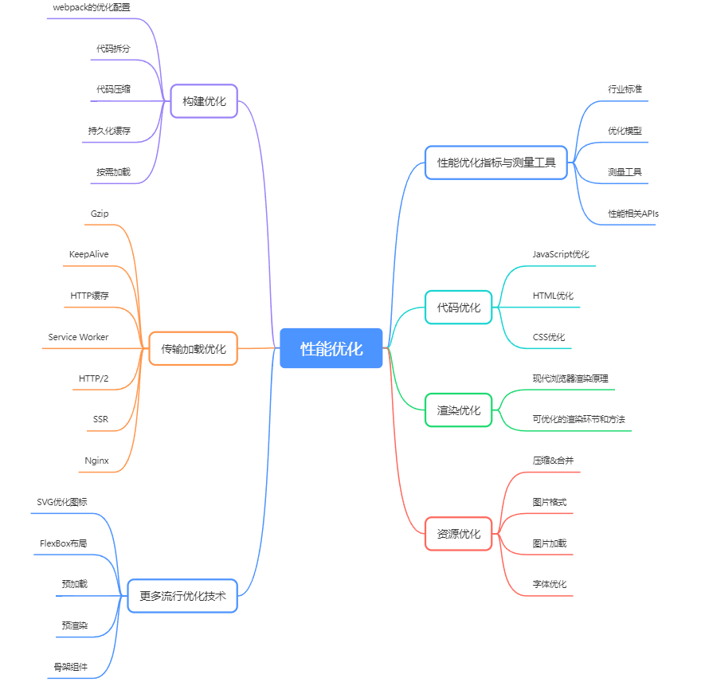

# 性能优化

{data-zoomable}

## 请求和相应优化

- 减少DNS查找
- 重用TCP链接
- 减少HTTP重定向
- 压缩传输的资源
- 使用缓存
- 使用CDN
- 删除没有必要的请求资源
- 在客户端缓存资源
- 内容在传输前先压缩
- 消除没有必要的请求开销
- 并行处理请求和响应
- 针对协议版本采取优化措施:升级到HTTP2.0
- 根据需要采用服务端渲染方式:结算SPA应用首屏渲染慢的问题
- 采用预渲染的方式快速加载静态页面:页面渲染的极致性能，比较适合静态页面

> 使用不同域名可以提供浏览器请求资源并发的效率，
但是多个域名又会造成DNS查找时间上的累加，因此一般将资源划分到至少两个但不超过四个域名

### dns预解析

```html
<link rel="dns-prefetch" href="https://g.alicdn.com">
<link rel="dns-prefetch" href="https://img.alicdn.com">
```

1. dns预解析仅对**跨域**域上的DNS查找有效，因此要避免指向当前站点或者域
2. dns-prefetch**需慎用**，多页面重复DNS预解析会增加重复DNS查询次数
3. 默认情况下高版本浏览器已经支持隐式的DNS预解析，不需要使用dns-prefetch，如果为了兼容低版本浏览器，或者想对页面没有出现的域进行预获取，就要使用dns prefetch
4. 虽然dns prefetch能够加快解析速度，但是不能滥用，禁用DNS预解析能够节约每月100亿的DNS查询

```html
<meta http-equiv="x-dns-prefetch-control" content="off">
```

### http长连接

对于同一个域名，大多数浏览器允许同时建立6个持久连接

### 请求体压缩

http1x也支持请求体压缩，需要客户端和服务端商量好压缩和解压算法

常见三种压缩格式,一般只压缩文本，因为压缩本身也是很耗时的操作，不适合图片和视频等

1. DEFLATE
2. ZLIB:对应HTTP中的Content-Encoding:deflate
3. GZIP:对应HTTP中的Content-Encoding:gzip

### http缓存

#### 强制缓存

> 客户端请求服务器，服务器告诉客户端可以强制缓存，客户端下次再请求该资源的时候，如果没有过期，直接使用该缓存，不需要再询问服务器

- Expires(不常用，可以直接用Cache-Control，一般只会在需要向下兼容时候使用)

```
Expires: new Date('2022-02-12 23:10').toUTCString() //这里是绝对时间
```

这样做有个局限性，如果客户端和服务器的时间不一致，就会产生很大的问题

为了解决expires的局限性，HTTP1.1新增`cache-control`字段对`expires`的功能进行扩展和完善

- Cache-Control

```
Cache-Control: max-age=5  //这里的单位是s,这里也就是5秒之内强制缓存
```

Cache-Control:

- `no-store` 表示禁止使用任何缓存策略
- `no-cache` 表示强制进行协商缓存
- `no-store` 和 `no-cache` 是互斥属性，不能同时设置
- `private` 不可被代理服务器缓存(例如nginx)，可以被浏览器缓存，是默认值
- `public` 既可以被代理服务器缓存(例如nginx)，又可以被浏览器缓存
- `private` 和 `public` 为互斥属性，不能同时设置
- `s-maxage` 在 `public`下有效，设置代理缓存的时长

一般对于不怎么会改变的文件，比如图片，CSS，js文件，设置public

```
Cache-Control:public,max-age:31536000
```

#### 协商缓存

> 客户端每次发起请求都不会去判断强制缓存是否过期，而是直接与服务器协商来验证缓存的有效性，若缓存未过期，则使用本地缓存。

- last-modified

```
Cache-Control: no-cache
last-modified: new Date('2022-02-12 23:10').toUTCString() //  绝对时间，一般取文件的修改时间
```

服务端(Node.js)示例

```js
const { mtime } = fs.statSync('./img/03.jpg')
const ifModifiedSince = req.headers['if-modified-since']
if (ifModifiedSince === mtime.toUTCString()) {
  // 缓存生效
  res.statusCode = 304
  res.end()
  return
}
const data = fs.readFileSync('./img/03.jpg')
res.setHeader('last-modified', mtime.toUTCString())
res.setHeader('Cache-Control', 'no-cache')
res.end(data)
```

last-modified这种做法有两个问题:

1. 是根据资源最后修改时间戳判断的，虽然对请求的资源做了编辑，但内容没有变化，时间戳也会更新，会导致验证失效
2. 判断的时间戳单位为秒，如果文件修改速度非常快，也无法识别有效性

- ETag(相当于计算文件的指纹)

服务端(Node.js)示例

```js
 const data = fs.readFileSync('./img/04.jpg')
const etagContent = etag(data)
const ifNoneMatch = req.headers['if-none-match']
if (ifNoneMatch === etagContent) {
  res.statusCode = 304
  res.end()
  return
}
res.setHeader('etag', etagContent)
res.setHeader('Cache-Control', 'no-cache')
res.end(data)
```

ETag也有不足，它是last-modified的补充方案，不是替代方案：

1. 计算ETag需要额外的计算开销，文件越大开销越大
2. ETag分为强验证和弱验证，强验证就是根据资源内容来验证，保证每个字节都相同，若验证根据资源部分属性生成，生成速度快但是无法确保每个字节都相同，并且在服务器集群场景下，因为不够准确而降低协商缓存的有效性。


#### 缓存决策

- 一般index.html设置协商缓存，Etag或者last-modified都可以
- 不经常变动的，例如图片这种设置为强制缓存，时间不宜过长一般max-age=86400
- style.css 这种打包出来会变成类似style.51ad833f5.css，这种文件变化一定会重新请求，所以可以直接设置强制缓存，同时考虑网络浏览器和中间代理的缓存，可以适当延长到一年，即cache-control: max-age=31536000
- js类似于css，如果涉及安全问题，不想把用户私人信息缓存到代理中，可以设置cache-control:private

### CDN缓存

主站域名为`www.taobao.com`,静态资源的CDN服务器域名有`g.alicdn.com`和`img.alicdn`等，他们是有意被设置成和主站域名不同的，主要有两点原因:

1. 由于同域名下每次请求都会携带Cookie信息，这样做可以避免对静态资源的请求携带不必要的Cookie信息
2. 考虑浏览器对同一域名下的并发请求限制(Chrome为6个)

## 渲染优化

### 关键渲染路径优化

- 缩小文件的尺寸(Minify)
- 使用gzip压缩(Compress)
- 使用缓存(Http Cache)

### 优化CSSOM

```html
<!-- 阻塞渲染 -->
<link href="style.css" rel="stylesheet">
<!-- 非阻塞的加载CSS -->
<link href="print.css" ref="stylesheet" media="print">
<!-- 拆分媒体查询相关CSS资源:可变阻塞加载 -->
<link href="other.css" ref="stylesheet" media="(min-width: 40em)">
<!-- 设备横屏加载的资源 -->
<link href="portrait.css" ref="stylesheet" media="orientation:protrait">
<!-- loading样式直接内联 -->
<style></style>
```

避免在css中使用`@import`，会增加关键渲染路径长度，原本是并行的，使用@import会变成串行加载资源

### 优化Javascript

- 异步加载js
- 避免同步请求
- 延迟解析js
- 避免运行时间长的js

#### 使用`defer`或者`async`延迟加载js

把`script`放到`</body>`前面会有个问题，就是如果html和css内容非常大的时候，只有当这些内容加载完了才会下载js，会造成延迟

使用`defer`属性，可以让浏览器尽早去请求js脚本，脚本会在DOM解析完毕之后，`DOMContentLoaded`之前执行，不会阻塞页面

- 对于多个`defer`脚本，后面的`defer`脚本会等到前一个`defer`下载完毕之后才会执行
- 对于多个`async`脚本，谁先加载完谁先执行，适用于脚本之间没有互相依赖关系

#### 使用`preload`，利用空闲时间预加载指定的资源

```html
<!DOCTYPE html>
<html lang="en">
<head>
    <meta charset="UTF-8">
    <meta http-equiv="X-UA-Compatible" content="IE=edge">
    <meta name="viewport" content="width=device-width, initial-scale=1.0">
    <title>Document</title>
    <!-- 利用空闲时间预加载指定的资源，不会阻塞页面的渲染 -->
    <link rel="preload" href="index.js">
    <link rel="preload" href="index2.js">
</head>
<body>
    <script src="index.js"></script>
    <script src="index2.js"></script>
</body>
</html>
```

#### 使用`prefetch`，预加载将来可能用到的资源(慎重使用)

例如当前路由是/home，可能会去加载/user下的资源，也就是预加载非当前页面的资源，如果`prefetch`设置的是当前页面的资源，可能会造成重复加载，因此使用的时候一定要注意

```html
<!DOCTYPE html>
<html lang="en">
<head>
    <meta charset="UTF-8">
    <meta http-equiv="X-UA-Compatible" content="IE=edge">
    <meta name="viewport" content="width=device-width, initial-scale=1.0">
    <title>Document</title>
    <link rel="prefetch" href="index.js">
    <link rel="prefetch" href="index2.js">
</head>
<body>
    <script src="index.js"></script>
    <script src="index2.js"></script>
</body>
</html>
```

### 尽量使用CSS动画，而不是JS

JS写动画尽量使用`requestAnimationFrame`而不是`setInterval`

### 恰当使用Web Worker

子线程一旦被创建，不会被主线程打断，因此子线程创建完要及时释放，有两种方式关闭

- 主线程调用worker.terminate()
- 子线程调用自身的全局对象self.close()
